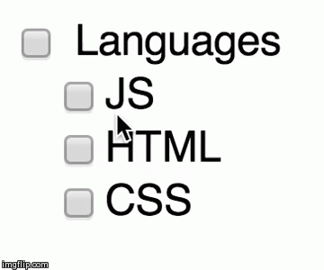
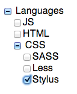

grouped-checkbox
================




Grouped Checkboxes is a [Polymer](http://www.polymer-project.org/) Web Component that makes it easy to have multiple checkboxes that have a parent selector.

## Usage

Wrap your input elements inside a `<grouped-checkbox>` element. `label` attribute is optional.

```html

<grouped-checkbox label="Languages">
    <label><input type="checkbox" name="tech" value="js">JS</label>
    <label><input type="checkbox" name="tech" value="html">HTML</label>
<grouped-checkbox>
```

### Nesting

Nesting `grouped-checkbox` components is possible. You can nest grouped checkboxes just like normal HTML elements


```html
<grouped-checkbox label="Languages">
  <label><input type="checkbox" name="tech" value="js">JS</label>
  <label><input type="checkbox" name="tech" value="html">HTML</label>
  <grouped-checkbox label="CSS">
    <label><input type="checkbox" name="tech" value="sass">SASS</label>
    <label><input type="checkbox" name="tech" value="less">Less</label>
    <label><input type="checkbox" name="tech" value="stylus">Stylus</label>
  </grouped-checkbox>
</grouped-checkbox>
```

### Nesting Demo

